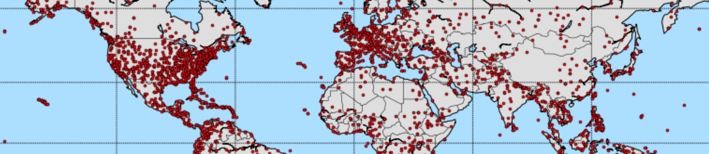

Plane Crash Info
================

Introduction
------------

This is an exploration of data found at http://planecrashinfo.com, a site that collects a lot of data about plane crashes back to ca. 1920. While it does a great job at collecting that data it presents only few plots trying to help with interpreting it. This notebook attempts to provide the means for easily accessing the data and exploring it using a more analytic/interactive/visual approach. To do so, standard tools from a Python-based data science stack are used, like Jupyter_, Pandas_, and Matplotlib_/Basemap_.

.. _Jupyter: http://jupyter.org
.. _Pandas: http://pandas.pydata.org
.. _Matplotlib: http://www.matplotlib.org
.. _Basemap: http://matplotlib.org/basemap/

**N.B.** This is work in progress… If you have any suggestion, please feel free to raise an issue or provide a pull request.

Installation
------------

Using Python 3 is recommended, because this is the future! ;-) And Conda is the recommended packaging system, since Pip cannot install Basemap. To install all dependencies in a fresh virtual environment (named `pci` short for `planecrashinfo` here), it is recommended to follow this procedure in your root environment:

.. code-block:: console

    # create virtual environment
    conda create -c conda-forge -n pci basemap pandas jupyter geopy

    # activate environment
    source activate pci

    # interact with the notebook
    jupyter-notebook planecrashinfo.ipynb

To deactivate and/or remove the environment again you simply do the following:

.. code-block:: console

    # deactivate environment
    source deactivate pci

    # remove environment
    conda-env remove -n pci

If you want to save a file describing this entire environment in order to recreate it later, you can also export the environment (once it's created) and recreate it from scratch as shown here:

.. code-block:: console

    # export environment
    conda-env export -n pci -f environment.yml

    # recreate environment from exported file
    conda-env create -f environment.yml

You can also try to use the `environment.yml` file contained in this folder.

Preparation
-----------

For the notebook to execute correctly it needs two data files, both included in this repo, ``data.csv`` and ``geolocs.json``. These can also be created by running the following commands, respectively::

  python build_database.py
  python build_geolocations.py

This might take quite a while, ca. 1-2 hours, and create a few additional CSV files, which are not needed for the notebook, but can be nice to play with.

Exploration
-----------

To get started exploring the data, just run the Jupyter notebook as follows::

  jupyter-notebook planecrashinfo.ipynb
